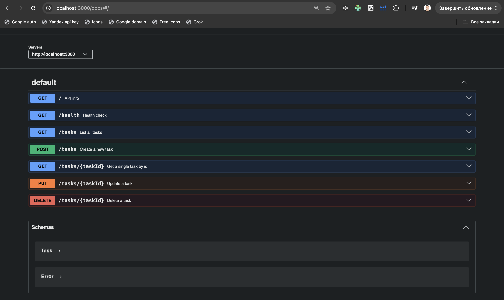

# Task API

A small CRUD API for managing a to-do list, built with **Node.js + Express**.
Data is stored **in memory** — there is no database, so all tasks reset when the server restarts.

Built for FlyRank W2 · A1.

---

## Requirements

- Node.js 18 or newer

## Install & run

```bash
npm install
npm start
```

The server starts on **http://localhost:3000**.

For development with auto-reload:

```bash
npm run dev
```

## Interactive documentation

Open **http://localhost:3000/docs** for Swagger UI.
Every endpoint is listed there with a **Try it out** button that sends real requests — no curl needed.



---

## Endpoints

| Method | Path | Description | Success | Errors |
|---|---|---|---|---|
| GET | `/` | API info (name, version, endpoints) | 200 | — |
| GET | `/health` | Health check — returns `{ "status": "ok" }` | 200 | — |
| GET | `/tasks` | List all tasks | 200 | — |
| GET | `/tasks/:taskId` | Get a single task by id | 200 | 404 |
| POST | `/tasks` | Create a task from `{ "title": "..." }` | 201 | 400 |
| PUT | `/tasks/:taskId` | Update `title` and/or `done` | 200 | 400, 404 |
| DELETE | `/tasks/:taskId` | Delete a task (empty body) | 204 | 404 |

### Task shape

```json
{ "id": 1, "title": "Buy milk", "done": false }
```

### Validation rules

- `POST /tasks` — `title` must be a non-empty string, otherwise **400**
- `PUT /tasks/:taskId` — if `title` is sent it must be a non-empty string; if `done` is sent it must be a boolean; otherwise **400**
- Any unknown id returns **404** with `{ "error": "Task 99 not found" }`

---

## Example request

```bash
curl -i -X POST http://localhost:3000/tasks \
  -H "Content-Type: application/json" \
  -d '{"title":"Buy milk"}'
```

```
HTTP/1.1 201 Created
X-Powered-By: Express
Content-Type: application/json; charset=utf-8
Content-Length: 40
ETag: W/"28-PpSBYV7i68cXyGc7AhjVpkZkY5Q"
Date: Sun, 23 Aug 2026 07:15:20 GMT
Connection: keep-alive
Keep-Alive: timeout=5

{"id":4,"title":"Buy milk","done":false}
```

### Full CRUD cycle

```bash
curl -i -X POST http://localhost:3000/tasks -H "Content-Type: application/json" -d '{"title":"Buy milk"}'   # 201
curl -i http://localhost:3000/tasks                                                                        # 200
curl -i -X PUT http://localhost:3000/tasks/4 -H "Content-Type: application/json" -d '{"done":true}'        # 200
curl -i -X DELETE http://localhost:3000/tasks/4                                                            # 204
curl -i http://localhost:3000/tasks/4                                                                      # 404
```

---

## The mortality experiment

Create a few tasks, stop the server (Ctrl+C), start it again, then run `GET /tasks`.

**What happened:** the tasks I created were gone, and the list was back to the same three example tasks it starts with.

**Why:** the tasks live in a plain JavaScript array inside the running process. That memory belongs to the process, so when the process ends the array ends with it — nothing was ever written to disk. This is exactly the problem a database solves, which is what Week 3 is about.

---

## Project structure

```
server.js       — the Express server and all seven routes
openapi.json    — hand-written OpenAPI 3.0 description, served by Swagger UI
package.json    — dependencies and the start/dev scripts
```
